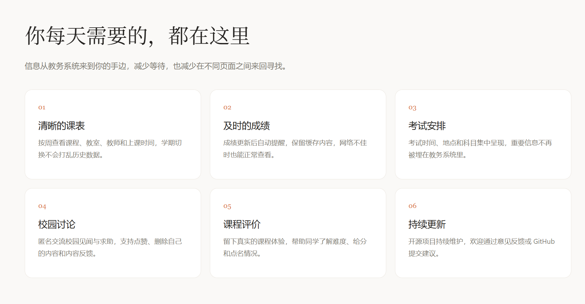

# iFAFU - 福农校园助手

福建农林大学校园助手 Android 客户端，提供课表、成绩、考试查询等功能。

## 快速入口

| 入口 | 地址 |
| --- | --- |
| 项目介绍页（杭州） | [116.62.222.192](http://116.62.222.192/) |
| 直接下载最新版 APK | [下载 iFAFU v2.5.5](http://116.62.222.192/downloads/ifafu-latest.apk) |
| 功能详情 | [features.html](http://116.62.222.192/features.html) |
| 下载说明 | [download.html](http://116.62.222.192/download.html) |
| 隐私与安全 | [privacy.html](http://116.62.222.192/privacy.html) |
| 香港备用站点 | [47.243.155.188](http://47.243.155.188/) |

> 国内用户建议优先使用杭州站点。香港站点在部分大陆运营商线路下可能出现延迟或下载中断。

## 项目一览

当前版本：**v2.5.5** · Android · Kotlin · MVVM

  

  

## 功能

### 学业工具
- **课表查询** — 一维列表 / 二维网格课表，支持调停补课信息、周次切换、左右滑动
- **成绩查询** — 按学期筛选，GPA 趋势图，加权均分、平均分与已出科目统计，新增/变更成绩提醒
- **考试安排** — 考试时间地点，自动检测时间冲突，复习进度标记，完成状态显示
- **成绩预测** — 设置平时分权重，预测期末需要多少分及格
- **教师评价** — 一键完成教师评价
- **课程评价** — 匿名课程评价共享，查看难度/给分/点名评分
- **校园讨论** — 匿名讨论区，基于 GitHub Issues
- **选修课程** — 在线选课、抢课

### 学习宠物
- **桌面宠物** — 首页浮动宠物，可拖拽、喂食、玩耍
- **AI 聊天** — 支持双模型切换（GLM 高质量 / Qwen 快速），结合用户课表/考试/成绩数据智能对话
- **等级变色** — 1-10级白色、10-20级金色、20-30级赤陶橙
- **签到积分** — 每日签到获取积分，连续签到奖励翻倍
- **状态联动** — 根据时间/饱食度/心情自动切换状态和动画表现
- **智能气泡** — 定时弹出今日课程、考试提醒、倒计时等实用信息

### 校园生活
- **校园地图** — 内置高德地图，三校区教学楼标注，GPS实时定位
- **目标倒计时** — 自定义倒计时事件，首页展示，宠物感知提醒
- **备忘笔记** — 文字+录音笔记，AI智能分类，宠物可读取笔记给出建议
- **番茄时钟** — 学习专注计时
- **成绩单** — 成绩可视化卡片

### 其他
- **课表分享** — 生成美化课表截图，一键分享到社交平台
- **日历导出** — 将课表导出为 .ics 日历文件
- **工具箱** — 培养计划、等级考试、个人信息、密码修改等
- **离线模式** — 课表、成绩、考试和个人信息优先展示缓存，标注更新时间，后台自动刷新
- **课程提醒** — 每日课程概览、可配置课前提醒及成绩新增/变更通知
- **自动更新** — 首页自动检测新版本，一键下载更新

## 技术栈

- Kotlin + MVVM + Hilt
- Jetpack Navigation + BottomNavigationView
- OkHttp + Jsoup（ASP.NET WebForms 网页抓取）
- WebView + Leaflet + 高德地图瓦片（校园地图）
- Lottie 动画 + Shimmer 骨架屏
- SharedPreferences + EncryptedSharedPreferences
- Material Design 3（Claude 风格主题）

## 更新日志

### v2.5.5
- **登录验证码自动重试优化**
  - 自动识别为空时会自动重新获取验证码图片并再次识别。
  - 服务端判定验证码错误后，丢弃旧验证码，重新抓取、识别并提交登录，最多自动重试 3 轮。
  - 自动重新登录流程同步增强验证码错误识别，账号或密码错误不会无意义重试。
- **反馈与敏感信息安全优化**
  - GitHub Issue、崩溃反馈、评论、昵称、点赞和课程评价等写操作统一通过 Cloudflare Worker 转发。
  - APK 不再内嵌 GitHub Token，公开读取接口改为匿名访问。
- **更新提醒体验优化**
  - 用户选择“稍后再说”后，当前版本将在 8 小时后再次提醒。
- **新增 Cloudflare Worker 部署源码**
  - 固定仓库与接口范围，GitHub 凭据仅保存在服务端 Secret 中。

### v2.5.4
- **修复寒暑假新旧学期课表串台**
  - 用户显式选择学年和学期时，一律使用精确学期接口，不再进入假期自动提升新学期的默认加载逻辑。
  - 课表主缓存与各学期缓存完全隔离，缓存 schema 升级至 4，自动清理旧版本写入的错位课表数据。
  - 寒暑假期间独立探测已发布的新学期课表；检测到真实课程后默认进入新学期，未发布时继续保留旧课表。
  - 修复连续切换学年、学期时后一次请求被丢弃或被旧请求覆盖的问题。
- **缓存与刷新体验优化**
  - 课表、成绩、考试、个人信息采用 10 分钟缓存优先策略，先显示旧内容再后台刷新。
  - 缓存状态统一显示数据来源与更新时间；网络失败时保留合法的空结果和历史数据。
  - 成绩刷新增加超时与重复请求保护，避免长时间停留在刷新状态。
- **成绩功能增强**
  - 成绩通知同时识别新成绩和已有成绩修订，首次启用不会批量通知历史成绩。
  - 统一 GPA 与加权平均分计算，完善成绩统计和学期显示。
- **课程提醒增强**
  - 支持每日课程概览以及提前 5/15/30/60 分钟提醒。
  - 修复提醒开关读取错误，避免关闭后仍然收到通知。
- **教务功能修复**
  - 修复个人信息页面被普通 JavaScript 提示误判为访问错误的问题，并增强字段解析兼容性。
  - 修复密码修改表单字段与成功结果判断，修改成功后自动同步新的登录状态。
  - 个人信息中的手机号和身份证号默认脱敏，长按可复制原始内容。
- **界面与交互优化**
  - 登录页、首页及信息弹窗调整为更克制的 Claude 风格视觉。
  - 优化首页课程时间线、数据状态展示和学期标签。
  - 修复首页宠物互动后卡墙、越界及无法回到原位置的问题。

### v2.5.3
- **成绩页新增"按出分先后排序"**
  - 教务系统不提供成绩录入时间，改为在本地记录每条成绩首次见到的时间戳，近似"出分先后"。
  - 有时间戳的成绩（最近新出的）排最前，无时间戳的历史成绩按学年/学期兜底排在后面。
- **成绩页新增 NEW 标记（仅最新在读学期，48 小时常驻）**
  - 用 `TermResolver` 按手机当前日期推断用户在读学期（如 2-7 月 → 上一学年第二学期），只有该学期的成绩才会进入 48 小时 NEW 窗口，历史学期成绩永不显示 NEW。
  - NEW 基于 firstSeenTs 时间窗口实时判定，刷新不丢失，满 48 小时自动下架；旧版本误标的历史学期时间戳会在下次拉取时自愈为 0。
- **成绩统计面板新增"平均分"与"已出科目数"**
  - 原 GPA 环 + 加权均分 + 总学分基础上，新增算术平均分和当前筛选范围内的科目数量，2×2 网格布局。
- **成绩分数红绿分级着色**
  - 及格（≥60）显示绿色，不及格（<60）显示暗红色，未出分灰色，红绿对比醒目。

### v2.5.2
- **修复课表学期结束后"今天"高亮错位一周的关键 bug**
  - 根因：二维课表 `calculateCurrentWeek()` 用 `coerceIn(minWeek, maxWeek)` 把超出课程范围的当前周（如第18周，但课程只排到17周）钳制回 `maxWeek`，导致日期行定位到上周一、且"今天"列永远无法高亮。
  - 修复：`coerceAtLeast(minWeek)` 仅约束下限，返回真实周次；标题超界时显示"课程已结束"；网格区给出空状态提示；周次选择器纳入当前周。
- **修复成绩缓存主键永远不会被清除的隐蔽 bug**
  - 根因：`CacheManager.clearCache()` 清理 scores 时漏掉了主数据键 `scores_$account`（仅清理 `_ts` 后缀键），导致学期切换 / 手动清缓存后旧成绩脏数据永久残留。
  - 修复：补全 `key == "scores_$account"` 及按学期分键的清理条件。
- **修复新学期第一条新成绩不推送通知**
  - 根因：`ScoreCheckReceiver` 用 `lastCount > 0 && currentCount > lastCount` 计数差判断新成绩，学期切换清缓存后 `lastCount=0` 直接漏报。
  - 修复：改用集合差逻辑（稳定 key `courseCode+year+term`），去掉 `lastCount>0` 前置，避免重修同名课误判。
- **修复首页倒计时卡片被过期事件占满**
  - 根因：`HomeFragment` 倒计时列表未过滤 `days < 0`，过期事件（负数）排在最前占满 3 个槽位，新建的未来事件被挤掉。
  - 修复：`mapNotNull` 内过滤掉已过期事件。
- **修复首页"第X周"chip 显示离谱大数字**
  - 根因：`MainViewModel.calculateCurrentWeek()` 仅 `coerceAtLeast(0)` 无上限，`termFirstDay` 过期时会显示"第30周""第38周"等荒谬值。
  - 修复：超 30 周返回 0 让 chip 隐藏，与今日课程区域的假期守卫一致。
- **修复考试当天过了结束时刻仍显示"未完成"**
  - 根因：`isExamFinished` 只比较到"天"，考试当天即使已过结束时间仍算未完成。
  - 修复：新增"考试当天"分支，解析括号内多个时段的最晚结束时刻判断是否已过。
- **虚拟定位地图移除显示异常的 OpenStreetMap 图层，仅保留高德卫星图与街道图**

### v2.5.1
- **修复宠物聊天弹窗打开即崩溃重启的关键 bug**
  - 根因：`dialog_pet_chat.xml` 中的关闭按钮为 `ImageButton`，但 `HomeFragment.kt` 代码中通过 `findViewById` 强转为 `MaterialButton`，导致 `ClassCastException` 崩溃。
  - 修复：将代码中的强转类型修正为 `ImageButton`。
- **优化考试安排页面布局，清除冗余的“未开始/未完成”状态标签**
  - 根因：
    - 考试解析器未过滤 `datelisthead` 类型或包含“选课课号”的表格标题行，导致误将表格标题解析为首个考试卡片展示出来。
    - 考试卡片中并排展示了“考试进行状态”和“复习进度状态”，对于已过期的历史考试，显示“已完成”与“未开始”混淆且无水平间距挤在一起。
  - 修复：
    - 在 `ExamParser` 过滤掉 class 为 `datelisthead` 以及第一列包含“选课课号”的标题行。
    - 仅对历史已考完科目展示“已完成”标签，隐藏复习状态；仅对未考试的未来科目展示复习状态标签，移除重合的“未完成”标签。
    - 优化了标签的布局参数，两个标签并存时增加 `8dp` 间距，并优化了圆角与 Padding 屏幕适配。

### v2.5.0
- **修复 2025-2026 学年课表/考试空白页面的关键 bug**
  - 根因：服务器 GET 默认返回当前学期数据时，代码仍做一次无意义的 POST 回发（EVENTTARGET=xqd），ASP.NET 对此回发返回空数据 → 页面空白
  - 修复：当目标学期与服务器 selected 默认一致时，直接复用 GET 响应解析，不再 POST
- 修复考试表格 CSS 选择器大小写：`Datagrid1` → `DataGrid1`（CSS 区分大小写，永远匹配不到）
- 修复课表主表选择器：新增 `table#Table1` 匹配 + 文本特征 fallback
- 修复选项解析边界：`parseSearchOptions` 的 endTag 从 startTag 之后搜索，避免向前误匹配
- 修复课表页无"校区"字样导致学期选项解析失败：统一改用 `id="xnd"/id="xqd"` + `</select>` 边界
- 过滤空的 option value（考试页首项 `<option value=""></option>`）
- 条件化 `__VIEWSTATEGENERATOR` 发送：HTML 中不存在此字段时不再发送空值
- POST 请求自动添加 `Origin` header，防止 WAF 拦截
- 过滤第三学期选项（学校设置错误，不显示学期"3"）

### v2.4.0
- 重制登录页 / 首页为 Claude 克制米白派风格（米白底、低饱和橙、Playfair serif 标题）
- 新增 Playfair Display Italic 字体，首页问候语改为 italic 大字号艺术 serif
- 新增学期推断器 `TermResolver`：按月份自动推断当前学年学期，避免服务端 select 默认 option 误判导致课表/考试显示错误学期内容
- 课表 / 考试 API 改为优先用推断学期 POST 请求，空数据时抛 AlertException 提示用户
- 修复登录验证码错误后无法登录的关键 bug：HtmlClient `postWithFollow` 抛 AlertException 被外层 catch 吞掉，导致验证码不刷新、autoCaptcha 一直是已被服务端消耗的旧值，用户多次点击都被服务端拒绝
- 登录页新增验证码错误自动重试：识别为验证码错时，后台静默刷新验证码并重新识别提交，最多再试 2 次（共 3 次），其他错误（账号 / 密码错）立即提示
- `UserApi.relogin()` 同步加上验证码错误判定：仅验证码错时才继续重试，密码错立即返回避免空耗 5 次
- 首页天气模块去除 emoji，改为 "多云 · 24°C · 降雨60%" 形式；课程行天气标同步改为 "多云 · 24°C"
- HtmlClient 多处 `.first()` → `.firstOrNull()` 加固，避免 Jsoup 1.18 NPE
- CacheManager 反序列化失败添加日志、新增按学期分键的成绩缓存
- 宠物状态衰减：使用 Asia/Shanghai 时区计算签到日期；时间倒退（用户改系统时间）时不衰减状态，避免数值异常
- 桌面 Widget：新增显式 ACTION_UPDATE 广播 + AlarmManager 30 分钟轮询，避免 Android 限制下 widget 不刷新

### v2.3.2
- 修复登录页面输入文字颜色与背景色相同导致看不见的问题

### v2.3.1
- 重构一键评教：支持课程下拉切换、评教材（dgPjc）评分、白名单/黑名单
- 新增课程保存状态标记（✓ 已保存/未保存）
- 添加提交总表按钮，手动触发最终提交
- 修复评教材 94-96 项缺失问题（控件名 jc1 而非 JS1）
- 修复「所有评价已完成，现在可以提交」alert 拦截导致无法提交的问题
- 修复评分 map 键冲突（DataGrid1 和 dgPjc 复用 ctlIndex）
- 修复拉黑后页面评分项未刷新

### v2.3.0
- 新增三花猫/云精灵宠物 + 宠物对话性格化
- 修复宠物类型丢失 bug

### v2.2.0
- 成绩查询默认显示最新学期成绩，不再显示"全部"
- 首页 header 晚间时段（18-23点）改为高级灰黑色渐变
- 工具箱虚拟定位工具调整至第一位
- 修复密码修改功能字段名与教务系统不匹配（Textbox4 大小写、按钮空格）
- 修复密码修改页面多余确认密码输入框，与教务系统保持一致

### v2.1.1
- 新增二维课表周切换过渡动画
- 修复笔记录音功能缺失录音权限
- 修复课表自动滚动位置偏移

### v2.1.0
- 新增宠物 AI 双模型切换（GLM 高质量 / Qwen 快速），聊天界面一键切换
- 新增宠物喂食/玩耍每小时恢复机制（上限3次，每小时恢复1次）
- 重构二维课表为按列绘制，跨多节课程合并为一个完整色块显示
- 课表单元格显示上课时间（如 08:00-09:35）和教室信息
- 课表课程弹窗显示具体上课时间段
- 安全加固：APK 内敏感信息保护
- 修复首页更新通知卡片不显示
- 修复校园地图点击越界崩溃
- 修复校园讨论屏幕旋转重复加载评论
- 修复更新下载镜像优先级

### v2.0.2
- 安全加固：移除 HTTP 日志拦截器，token 迁移至 EncryptedSharedPreferences
- 安全加固：WebView URL 白名单、第三方 Cookie 禁用、APK R8 混淆启用
- 安全加固：精简 AndroidManifest 权限
- 修复密码修改功能（添加原密码输入、修正表单字段映射）
- 修复 ViewState 并发竞态条件（多步 ASP.NET 表单操作改用显式状态传递）
- 修复课表详情弹窗配置变更后数据丢失（改用 Bundle 保存参数）
- 修复跨年考试完成状态误判（年份优先比较逻辑）
- 修复更新下载后安装崩溃（FileProvider 路径配置补全）
- 修复 6 处协程 CancellationException 吞异常问题
- 修复 Fragment 生命周期安全（Handler 泄漏、ValueAnimator 泄漏、binding 空指针）
- 修复课表解析正则（支持"上午/下午/晚上"时间段）
- 修复 GitHub Issues 昵称查询分页、成绩查询重登录后文档过期
- 优化 OkHttp Response 资源释放、Settings 页面上下文安全

### v2.0.0
- 新增校园地图（三校区高德地图、教学楼标注、GPS定位）
- 新增目标倒计时（自定义事件、首页展示、宠物联动提醒）
- 新增备忘笔记（文字+录音、AI分类、收藏、宠物可读取笔记）
- 新增番茄时钟、成绩单可视化
- 新增考试完成状态显示（已完成/未完成）
- 新增首页自动检测更新（新版本卡片提示、一键下载）
- 修复课表学期切换 bug（学期过期检测、缓存自动清除、跨年周次正确显示）
- 修复宠物聊天首次连接超时（增加重试机制和超时配置）
- 修复成绩单功能不显示（反序列化类型修复）
- 修复笔记 AI 归类返回为空

### v1.5.0
- 新增学习宠物系统（桌面宠物、AI聊天、签到积分、等级变色、状态联动、智能气泡）
- 新增成绩预测计算器（设置平时/期末权重，预测及格所需分数）
- 新增课程评价共享平台（匿名评价、难度/给分/点名评分）
- 新增考试复习进度标记（未开始/复习中/已掌握，宠物联动鼓励）
- 新增社交课表分享（美化截图、品牌水印）
- 新增聊天记录持久化（关闭重开保留历史）
- 修复 36 个已知 bug（网络异常处理、登录态失效、解析容错等）
- 全面 UI 美化（首页时间线、考试卡片、错误布局、暗色模式适配）

### v1.0.0
- 初始发布版本

## 致谢

此应用借鉴了 FAFU 18 届学长的开源项目，由 24 届网络工程 KYZZ 进行重写。感谢开源社区的贡献。

## 开源协议

本项目秉承开源精神，所有人都能免费使用。
